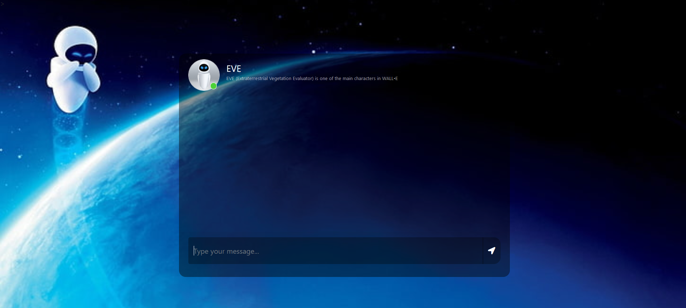

# EVE - Themed ChatBot - Made by Harsh Deepak Singh
EVE (which stands for Extraterrestrial Vegetation Evaluator) is the deuteragonist of the 2008 Disney/Pixar animated feature film, WALL-E.
## Installation & Setup

[Install Python] https://www.dataquest.io/blog/installing-python-on-mac/

[Install pip] https://phoenixnap.com/kb/install-pip-mac

If you have Python & pip installed then check their version in the terminal or command line tools

```
python3 --version
```

```
pip --version
```

## Installing Flask

In your terminal run the requirements.txt file using this pip

```
pip install -r requirements.txt
```


## Running ChatBot Application in Terminal

```
cd into your directory
```

```
python app.py
```


## The Project 

This chatbot is designed to carry out conversations with users using natural language processing. It utilizes Microsoft DialoGPT, a pre-trained language model capable of generating human-like responses to given prompts. The integration with Flask, a popular Python web framework, allows the creation of a web application for communication with users through a chat interface.

For the frontend of this application, HTML, CSS, and JavaScript are employed to create a visually appealing and interactive chat interface. jQuery is used to handle the HTTP requests made to the backend server.
# ChatBot Link
The Chatbot is constructed using the Microsoft/DialoGPT-medium model.

```
https://huggingface.co/microsoft/DialoGPT-medium
```
